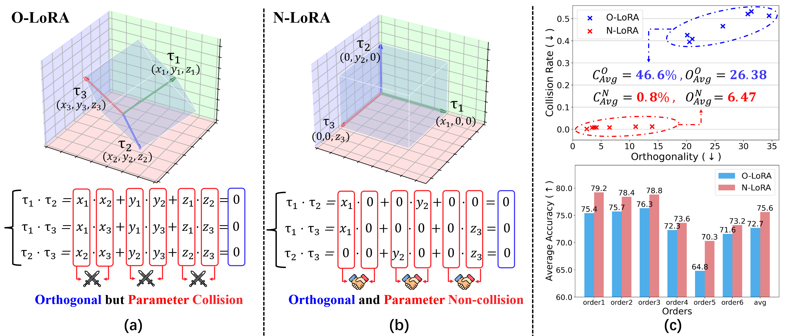

<h2 align="center">
    <a href="https://arxiv.org/abs/2410.10179">Is Parameter Collision Hindering Continual Learning in LLMs? 【Coling 2025🔥】</a>
</h2>
<h5 align="center"> Code for the N-LoRA method introduced in the COLING 2025 paper 'Is Parameter Collision Hindering Continual Learning in LLMs?', , exploring novel approaches to address parameter collision issues in large language models for continual learning. 
<h5 align="center"> If you like our project, please give us a star ⭐ on GitHub for latest updates. </h5>

<h5 align="center">
    
[](https://arxiv.org/abs/2410.10179) <br>
[](https://github.com/PKU-YuanGroup/N-LoRA/blob/main/LICENSE) 
[](https://hits.seeyoufarm.com)
[](https://github.com/PKU-YuanGroup/N-LoRA/issues?q=is%3Aopen+is%3Aissue)

</h5>

<p align="center">
    
</p>
<p align="center" style="font-size: 14px; font-style: italic;">
    The Relationship Between Parameter Collision and Orthogonality in Continual Learning
</p>

<p align="center">
    
</p>
<p align="center" style="font-size: 14px; font-style: italic;">
    Parameter collision analysis and nuclear norm distributions for O-LoRA and N-LoRA. O-LoRA exhibits higher parameter collisions and nuclear norms, while N-LoRA effectively reduces collisions, ensuring better orthogonality and task-specific accuracy.
</p>


## 🛠️Setup

You can install the required libraries by running 

```
pip install -r requirements.txt
```

You are also required to download the t5-large model from huggingface, put it to the folder named ```initial_model```, and rename the model folder as 't5-large'.

LLaMA is also supported. You can put your llama model to the folder named ```initial_model``` and rename the model folder as 'llama'.


## 🚀Training and Evaluation

For t5-large:

You can reproduce our experiments of order 1 & 2 & 3 & 4 & 5 & 6 by simply running

order1:

```
bash scripts/order_1.sh> logs_and_outputs/order_1/logs/train_and_infer.log 2>&1 &
```

order2:

```
bash scripts/order_2.sh> logs_and_outputs/order_2/logs/train_and_infer.log 2>&1 &
```

order3:

```
bash scripts/order_3.sh> logs_and_outputs/order_3/logs/train_and_infer.log 2>&1 &
```

order4:

```
bash scripts/order_4.sh> logs_and_outputs/order_4/logs/train_and_infer.log 2>&1 &
```

order5:

```
bash scripts/order_5.sh> logs_and_outputs/order_5/logs/train_and_infer.log 2>&1 &
```

order6:

```
bash scripts/order_6.sh> logs_and_outputs/order_6/logs/train_and_infer.log 2>&1 &
```


The model you have trained will be saved in ```logs_and_outputs/order_1(2 or 3 or 4 or 5 or 6)/outputs```.

The result of each task will be saved in ```logs_and_outputs/order_1(2 or 3 or 4 or 5 or 6)/outputs/TASK_NAME/predict_results.json```.

You can also check the logs during training and infering in  ```logs_and_outputs/order_1(2 or 3 or 4 or 5 or 6)/logs/train_and_infer.log```

For LLaMA:

order1:

```
bash scripts_llama/order_1.sh> logs_and_outputs_llama/order_1/logs/train_and_infer.log 2>&1 &
```

order2:

```
bash scripts_llama/order_2.sh> logs_and_outputs_llama/order_2/logs/train_and_infer.log 2>&1 &
```

order3:

```
bash scripts_llama/order_3.sh> logs_and_outputs_llama/order_3/logs/train_and_infer.log 2>&1 &
```


## 🙏 Acknowledgment

This repository is adapted from [O-LoRA](https://github.com/cmnfriend/O-LoRA). We sincerely thank the authors of O-LoRA for their contributions and efforts, as their work provided inspiration for this research. We also appreciate their contributions and the assistance provided by the authors.


## 📝 Citation

If you find this paper useful, please consider staring 🌟 this repo and citing 📑 our paper:

```bibtex
@article{yang2024parameter,
  title={Is Parameter Collision Hindering Continual Learning in LLMs?},
  author={Yang, Shuo and Ning, Kun-Peng and Liu, Yu-Yang and Yao, Jia-Yu and Tian, Yong-Hong and Song, Yi-Bing and Yuan, Li},
  journal={arXiv preprint arXiv:2410.10179},
  year={2024}
}
```


